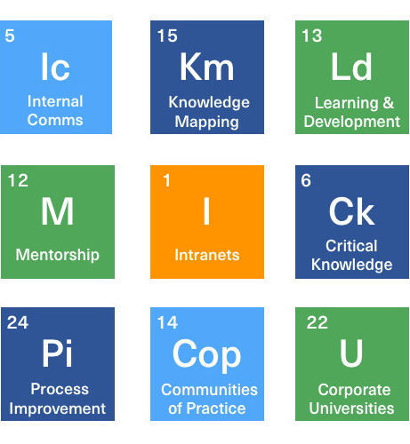

# KA Connect 2019

> Apr 30th - May 2nd 2019, San Francisco

## Elevating the Employee Experience

This year’s conference focussed on the following knowledge management program elements:

- Internal Communications

- Intranets 

- Learning & Development

- Corporate Universities

- Critical Knowledge Transfer

- Mentorship

- Communities of Practice

- Knowledge Mapping

- Process Improvement

## Twitter

[#KAConnect2019](https://twitter.com/search?vertical=default&q=%23KAConnect2019&src=typd)
