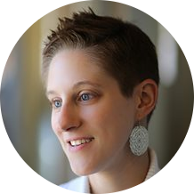

# Orchestrating Cultural Transformation Through Communications and Collaboration

 
Karen Robichaud, Payette

## TL;DR
...

## Speaker Profile
Karen joined Payette in 2012 as a graphic designer and has since led several communications initiatives from the ground-up for the firm. From the outset, Karen established Payette as a leader among other architecture firms with social media strategy, leveraging many voices across the firm. As she positioned the firm in the social media sphere, Karen took on the firm’s external communications strategies and PR initiatives. Karen is a leading voice in building a culture of communication at an architecture firm and has presented her work in a number of venues; AIA SF Equity by Design Symposium, AIA National Conferences, AIA COTE Annual Summit, SMPS Boston, and the Boston Society of Architecture. Karen earned her BA in English and Theatre Arts from the University of Richmond.

## Talk Abstract
Since its founding in 1932, Payette has intentionally and continuously modernized its culture. Today, employees describe the culture of this 87-year-old firm as inclusive, highly collaborative, and transparent. These cultural elements work together to empower all employees to dream big and achieve personal and professional goals, regardless of tenure, status, or role. In this talk, you’ll learn how Payette’s team has orchestrated cultural transformation through knowledge management approaches such as internal and external communications, non-hierarchical knowledge exchanges, and inclusive collaboration.

## The Connection Economy
Seth Godin, The Icarus Deception

## COTE Awards
High performing firms report