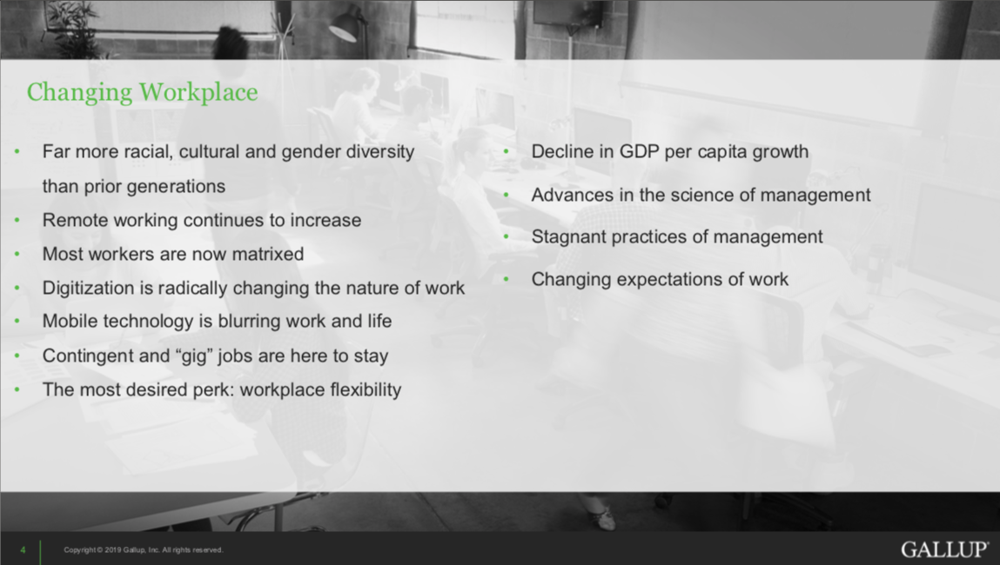

##### KA Connect 2019 {docsify-ignore}
# How to Design an Exceptional Employee Experience {docsify-ignore}

  
Jim Harter Ph.D, Chief Scientist - Gallup

## TL;DR
- Gallup continue to conduct huge amounts of research on employee engagement. The workplace and workforce are changing rapidly and with that, employee expectations are also shifting. 

- Higher employee engagement leads to improved business results.

- Employee engagment should not be a separate program, it should be embedded in every process and system within the organisation.

- Getting the Manager experience right first, has a cascading effect to the experience of their teams. 

- Managers need to transition from being a boss to being a coach.

## Talk Abstract
Jim Harter, Ph.D., is Chief Scientist of Workplace Management and Well-Being for Gallup's workplace management practice. In his KA Connect 2019 keynote talk, Dr. Harter will discuss Gallup's latest research on the employee experience, from attraction to exit, and what it takes to build an exceptional culture and employment brand that matches the expectations of the new and future workforce.

## Speaker Profile
Dr. Harter is a coauthor of the New York Times bestseller '12: The Elements of Great Managing', an exploration of the 12 crucial elements for creating and harnessing employee engagement. His book, the New York Times and Wall Street Journal bestseller, 'Wellbeing: The Five Essential Elements', is based on a global study of what differentiates people who are thriving from those who are not. His research is also featured in First, Break All the Rules: What the World's Greatest Managers Do Differently, the book that proves the link between employee opinions and productivity, profit, customer satisfaction, and the rate of turnover.

He is the primary researcher and author of the first large-scale, multi-organization study to investigate the relationships between work-unit employee engagement and business results. Updated periodically, this study currently covers 82,000 business units and includes 1.8 million employees in 230 organizations, across 49 industries, and in 73 countries. His work has appeared in many publications, including Harvard Business Review, The New York Times, The Wall Street Journal, Fast Company, TIME Magazine, and in academic articles and book chapters. 

Since joining Gallup in 1985, Dr. Harter has authored or coauthored more than 1,000 research studies for organizations on employee engagement and talent and on topics in applied psychology and well-being. His specialties include psychological measurement and estimating the economic impact of management initiatives.

## Intro
Gallup study people and workplaces. They have a workplace database of their research which contains information on 70m people that they have studied.

As the workforce changes, will the traditional command and control management approach work in the future?

## What is the purpose of an organisation?
Some people might say the purpose of an organisation is to "improve lives". But this purpose should apply to lives inside and outside of an organisation.

Quote: An organisation is about..."Not just getting work done through people, but getting people done through work"

### Changing Workplace
The most desired perk from employees is workplace flexibility.

### Shifting Employee Expectations

### Employees are Looking and Leaving

### Employee Engagement
Gallup have been measuring employee engagement around the world on a daily basis for nearly 20 years.

Best practice organisations see share price growth at 4.3x the competition.

Employee engagement needs to be embedded in accountability, communications, and personal development systems.

### A Year in the Life
Gallup tracked levels of happiness and stress in a group of Americans by measuring levels of Cortisol (stress hormone).
The results showed that people are happier on weekends/holidays because of the autonomy they have in their lives. Workplaces can also be autonomous.

## Defining Employee Experience
### Employee Lifecycle
The employee lifecyle is defined as the stages where organisations can intervene to impact the employee experience.

### Employee Experience
The employee experience is defined as the journey an employee takes with your organisation.

The culture of your organisation gets transmitted outside of company when employee leaves.

### Employee Value Proposition

### Depart
When employees depart the organisation, make sure that:
- Employees feel heard
- They're sent off feeling proud of their contribution
- They remain brand ambassadors

### Attract

### Onboard
Answer these 5 questions for every new person

### Hire

Combine multiple interviews to negate biases

## Books

## Engage
For employees to be engaged, they need the following

#### Additional Impact

70% of team engagement comes from manager in manager led teams

### Performance Development
Establish Expectations
Continually Coach
Create Accountability

#### Coaching Conversations
Five conversations that Drive Performance

Why is "ongoing conversations" easier said than done?
Discover your Clifton Strengths/StrngthFinder 2.0 - Don Clifton

##### Strengths - A short-cut to development

### Why is organisational change so hard?
- Tribes - bringing multiple teams together
- The Manager Experience - get that right and cascades to team
- Easy to shift to its us not them

### The Manager Experience

#### Where Managers Thrive

#### Where Managers Struggle
Organisations often put people into managerial roles for the wrong reasons:
- They are the highest performers
- They have been with the organisation for a long time

If you can get the manager experience right, it will improve the employee experience of people in their team.

### Hire
5 traits for great managing

Less than 30% of managers strongly agreee that someone at work actively encourages their development

## Gallup Path Microeconomics
A behavioural economic model for organisations

Book: Its the Manager - Jim Clifton, Jim Harter

## Q&A
Employee engagement shouldn't be a program. It should be embedded, not a separate thing. It is not just a survey.

Managers need to learn to go from Boss to Coach

Managers need to be much more collaborative and involved with team, rather than delegating

## Gallup Copyright Standards

