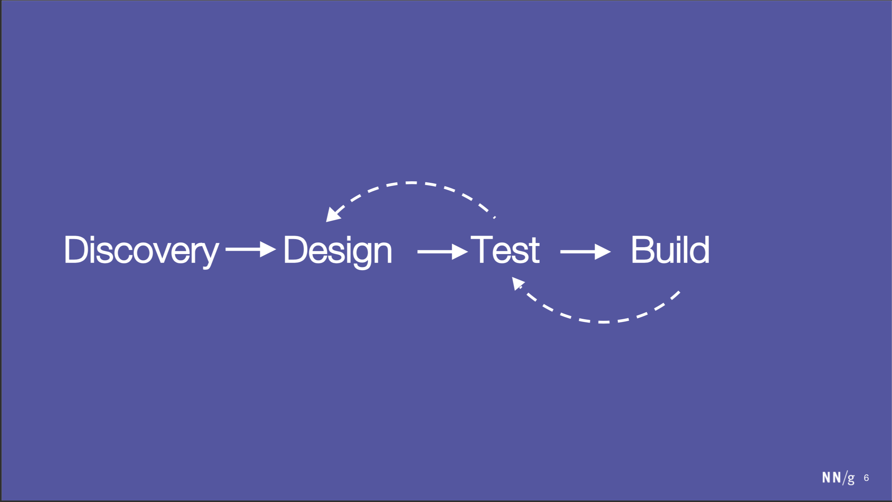
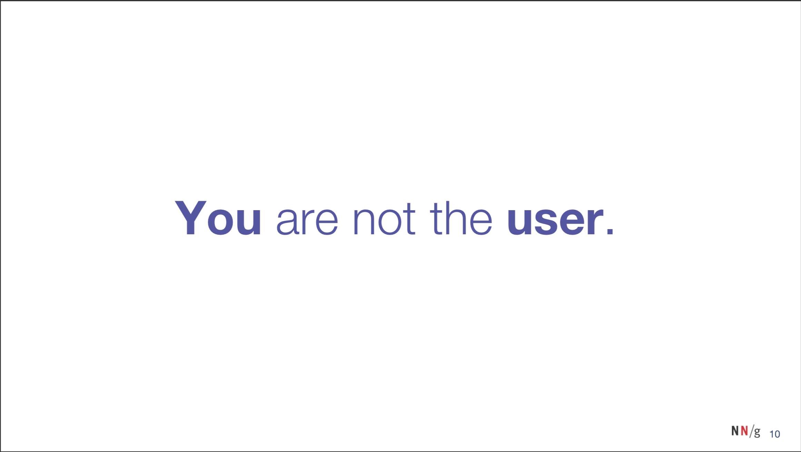

##### KA Connect 2019 {docsify-ignore}
# Designing Better Intranets Through User Centered Design {docsify-ignore}

  
Kathryn Whitenton, Nielsen Norman Group

## TL;DR
```text
- Put the end user at the center and foundation of decision making.

- Testing with 5 users uncovers 85% of major problems for that group of users

- Avoid using category terms that are too broad, overlapping or jargon
```

## Speaker Profile
Kathryn Whitenton is the Director of Digital Strategy at Nielsen Norman Group, a firm which is recognized around the world as a leader in the field of user experience for more than 20 years. Kathryn consults with clients to evaluate and improve designs for both consumer-oriented systems and for large intranets, from Fortune 500 industry leaders to small startups, in diverse industries including finance, professional services, health care, media, technology, and telecommunications.

## Talk Abstract
The first step toward a successful intranet is making your firm's essential content easily accessible. If your employees cannot find your firm's standards, best practices, checklists, templates, and policies, they might as well not exist. Unfortunately, many intranets are designed by committee, without being tested and validated by end users, often resulting in confusing navigation and organizational structures.

The solution is to leverage the insights of your employees through user-centered research and design methods when developing the information architecture for your intranet. This talk will explain exactly how you can incorporate proven methods for understanding user expectations into your intranet's design. Learn how intranet teams have used simple techniques (such as usability testing and card sorting) to create great employee experiences.

## About Nielsen Norman Group

We observe people interacting with systems and software and 
use observations to recommend guidelines and ideas for how things can be improved.

We have a strong focus on Intranets.

## Intranet IA: Most Common Problems
Start by looking at the people who use the Intranet.
- What do they expect?
- What would make sense to them?

The most common Information Architecture problems on Intranets are:
- Confusion between categories
- Unclear terminology or acronyms
- Inconsisten design, content or navigation


## Design and build

Test your designs with users more frequently

## User Centered Design


Put the end user at the center and foundation of decision making.

### User Centered


### Department Centered


Don't need to know who's responsible for what. Just what their questions is.
'Working at BVN' section instead of finance



The Intranet should make sense to all the users.

## 5 Ways to learn about users {docsify-ignore}


## Analytics


## Surveys
Ask users for their opinions

Which is the most important to improve on the Intranet?
Most important was Ease of finding information

Benefits: Quick and easy. Provides good starting points for prioritization
Limits: Describe what, but not why. Surveys describe beliefs which may be mistaken or incomplete

## Usability Testing
Observe people using the system while they explain their actions

### 101
- List most important tasks people need to do
- Watch real users as they attempt to perform those tasks
- Users Think out loud as they work to explain their actions
- Facilitator observes behaviour and comments, and asks neutral follow up questions

Task example: Find a pair of shoes on this site that you might like to buy

### When should you do a usability test
Before, During and After!


#### Information Scent
Users estimate a given hint's like success from the spoor (a track, a trail a scent)

##### Root causes of poor information scent
Too Broad: Labels that try to encompass too many things become meaningless, and are not attractive starting points

Overlapping: Multiple categories which refer to similar concepts create doubt and confusion about which trail to follow

Jargon: Label which use on aronyms, brand terms or internal lingo will be meaningless to some users
Often you assume everyone knows these terms. Makes it much more difficult for those users who don't

When people don't know what to click on, they click on nothing


## Card Sorting
Asks user to organize content the way they would expect to find it
- What categories do people create?

#### 101
1. Create a card for each content item
2. Have each participant organize the cards into groups as they see fit
3. Each participant names each group they create
4. Have users explain each group
5. Compile all groups created by all participants and look for patterns

#### Online Card Sorting
OptimalSort
Userzoom
UsabilityTools
Useabilitest
Simplecardsort

#### Case Study
Legacy intrnaet orgranised by department
Did card sorting study
Shortcut menus provided access to frequently used, task-related content

Quick Links, Resources, I Want to... menus

##### Findings
Identified common task areas common to most job roles
More specific content was grouped by the type of work being done
Provided data to explain why organizing content into categories such as documents would not fit users expectation

## Tree Testing
Ask users to find a topic using your proposed menu structure
- Are people

#### 101
1. List all categories and subcats you plan to use
2. Enter your tree into a tool (Treejack) which will transofmr it into clickal interactive menu
3. Write a list of tasks which require users to find important categories
4. Invite users to the study


## Q&A
When repeating same type of tree testing, choose different people each time

Card sort: Min is 15 people
For remote survey: 50 people

If roughly equal perspectives: need to pick one. Provide lifeline to poeple who's viewpoint wasn't used.
Try to provide secondary way of accessing information

For new content, do usability test or tree test and see if users can find new content

Do behavioural change intentionaly
Have low bar to entry on system to engage them, then once engaged can modify their behaviour

The three clicks rule: Nothing should be more than three clicks away
